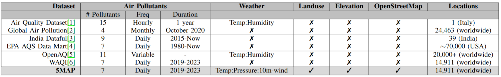
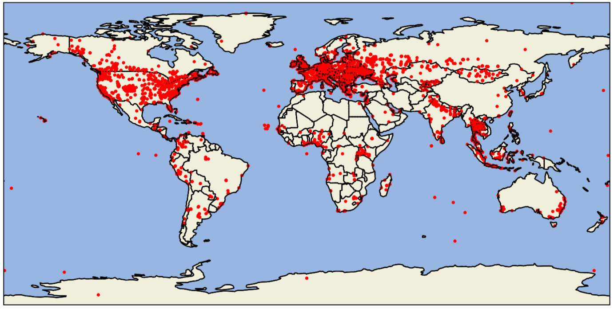
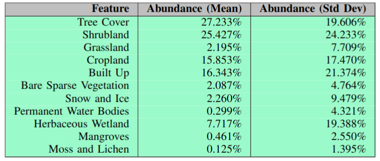
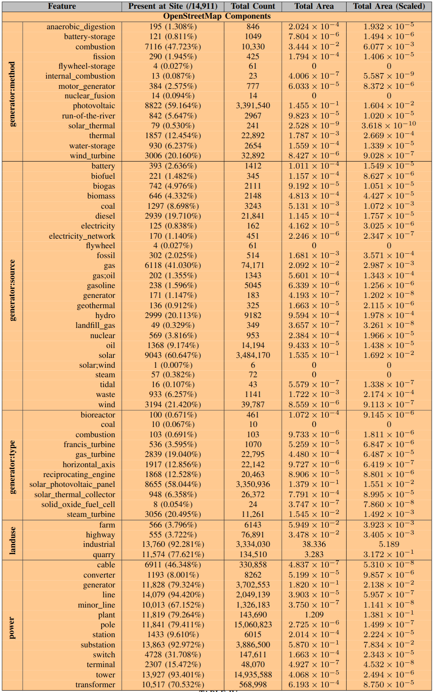
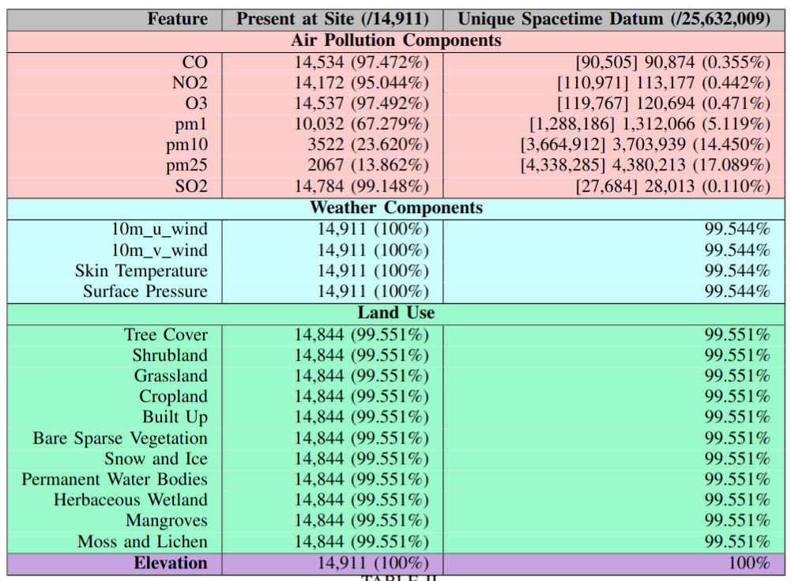

# 5MAP: 5 Modalities Aligned for Air Pollution
Augmenting air pollution readings with 4 other modalities:

## **1. Air Pollution:** 
- [WAQI](https://waqi.info/)
    * `PM-25`
    * `PM-10`
    * `PM-1`
    * `o3`
    * `no2`
    * `co2`
    * `co`
- Daily, Over 3+ years
- ~15,000 sites worldwide


## **2. Weather:**
- ERA5 re-analysis from [copernius](https://pypi.org/project/cdsapi/)
    * `100m_u_component_of_wind`
    * `100m_v_component_of_wind`
    * `10m_u_component_of_wind`
    * `10m_v_component_of_wind`
    * `2m_temperature`
    * `skin_temperature`
    * `surface_pressure`
    * `total_precipitation`
- At each EXACT lat-lon geo-cords for the above ~15,000 sites
- Hourly

## **3. Landuse:** 
- [Worldcover 2021 ESA](https://worldcover2021.esa.int/download)
    * `tree_cover`
    * `shrubland`
    * `grassland`
    * `cropland`
    * `built_up`
    * `bare_sparse_vegetation`
    * `snow_and_ice`
    * `permanent_water_bodies`
    * `herbaceous_wetland`
    * `mangroves`
    * `moss_and_lichen`
- Gathered statistics in a 15km radius around each site (from tiff)


## **4. Elevation:**
- The height above sea level at each ~15,000 site

## **5. OpenStreetMap:**
- Semi-structured list of things related to air-pollution
```python
tags = {
    "power": True,
    "man_made": ["petroleum_well", "monitoring_station"],
    "landuse": ["industrial", "highway", "motorway", "quarry", "depot", "farm"],
}
```
- Return features are as follows




## Installation
- `git clone git@github.com:Jumperkables/clean_air.git`
- Make and source a python virtual env
- `pip install -r requirements.txt`

## Data Preparation
0. Acquire a [WAQI API access token](https://aqicn.org/data-platform/token/). Save it in this directory as `.WAQI_API_TOKEN` 
1. `python src/get_aqicn_station.py`: Generate a csv file for all stations. Includes name, id, lat-lon co-ords.
You can run the next two steps at the same time if you want.
2. `python src/get_OSM_features.py`: For each station, get the relevant OpenStreetMap features. Ther version of OpenStreetMap data in our publication can be found [here](https://somewhere_tom_hosted.com).
3. `python src/get_aqicn_readings.py`: Get all available readings for particulates at daily granularity.

## Data Explortation
`python src/explore_osm.py`
